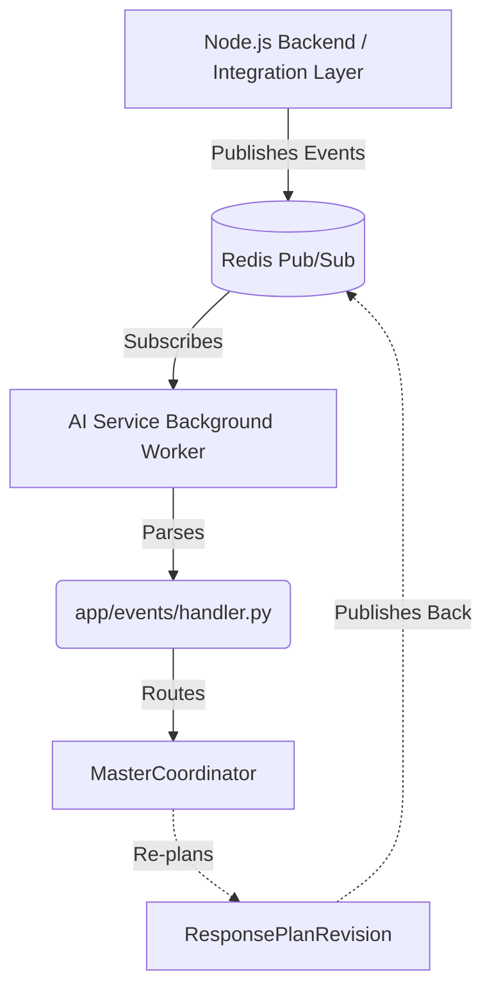

# Event-Driven Architecture Design (Future Extension)

This document outlines the planned future migration to an event-driven architecture utilizing Redis Pub/Sub, moving beyond the current synchronous HTTP `/api/ai/analyze` integration.

## Motivation
Disaster scenarios are highly dynamic. Relying strictly on synchronous HTTP requests means the AI cannot proactively re-evaluate a plan when a road becomes blocked or rainfall dramatically increases. By introducing event-driven capabilities, the system transitions from a "request/reply" model to a "reactive" one.

## Proposed Architecture

## Abstractions Provided

We have established the following abstractions in `app/events/`:

1. **Schemas (`app/events/schemas.py`)**:
   - `EventType`: Standardized event types like `NEW_INCIDENT`, `ROAD_BLOCKED`, `WATER_LEVEL_CHANGED`.
   - `EventMessage`: The standard envelope for all events flowing across the wire.

2. **Routing (`app/events/handler.py`)**:
   - `MasterEventHandler`: Receives the `EventMessage`, determines if it's an infrastructure change, an environmental change, or a new incident, and prepares to route it to `MasterCoordinator`.

3. **Configuration (`app/config/redis_config.py`)**:
   - Contains the connection configuration structure for Redis settings.

## Implementation Steps

When the team is ready to activate event processing:

1. **Install Dependencies**: `pip install redis aioredis`.
2. **Implement Subscriber Loop**: Create a background task in `app/main.py` (via FastAPI `lifespan` or `@app.on_event("startup")`) that connects to Redis and listens on `redis_config.events_channel`.
3. **Parse and Delegate**: In the subscriber loop, parse the raw JSON string into an `EventMessage` and pass it to `MasterEventHandler.handle_event()`.
4. **Implement Handler Logic**: Complete the `TODO` stubs in `handler.py` to correctly map event payloads to `DisasterAnalysisRequest` or `ReplanRequest` objects.
5. **Publish Results**: Once `MasterCoordinator` produces a `ResponsePlanRevision`, serialize it and publish it back to Redis on a dedicated output channel (e.g., `ai_responses`).

## Rule: Preserve Synchronous API
The synchronous `POST /api/ai/analyze` endpoint MUST NOT be removed. It serves as the initial trigger and is vital for stateless testing and immediate synchronous feedback during development. Event-driven processing serves strictly as an asynchronous *enhancement* layer for ongoing replanning.
